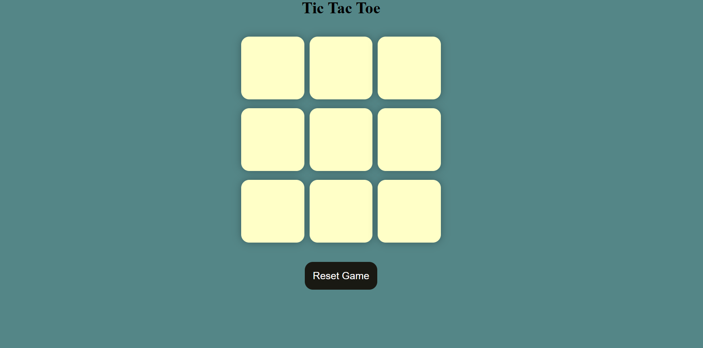
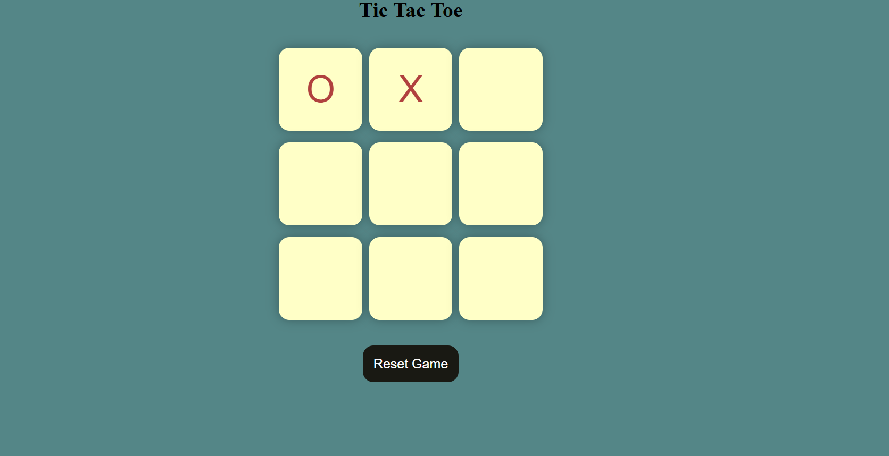
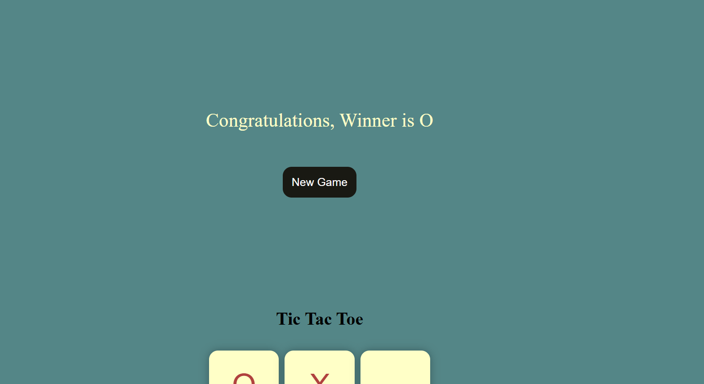
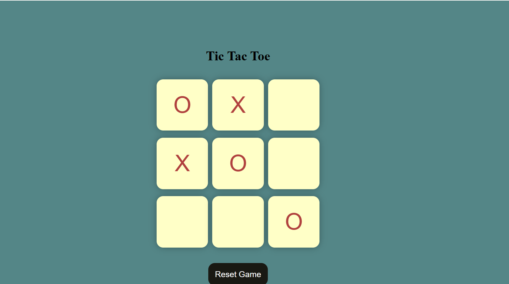
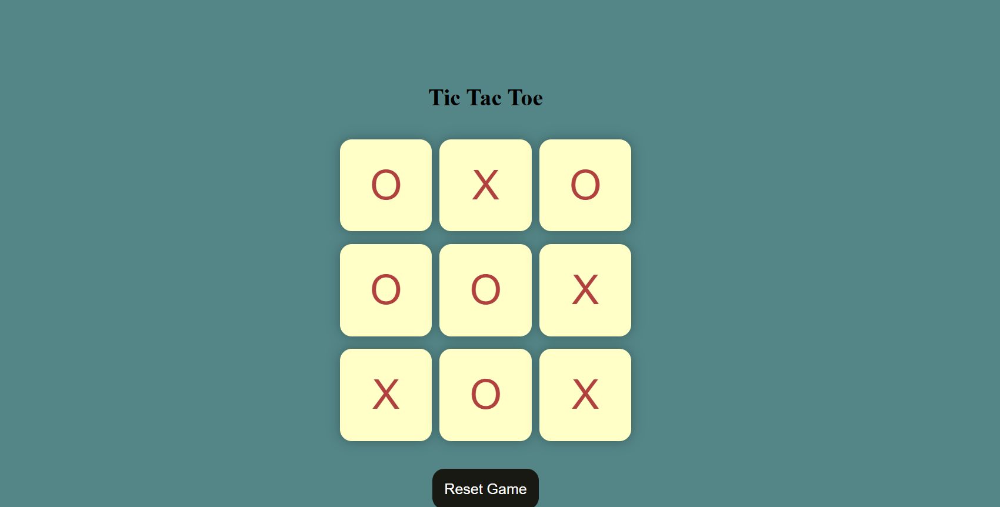

# ❌⭕ Tic Tac Toe Game

A simple and interactive Tic Tac Toe game built using HTML, CSS, and JavaScript.

## 🚀 Features

- ❌ X player
- ⭕ O player
- 🎮 Two-player gameplay
- 🏆 Automatic winner detection
- 🤝 Draw detection
- 🔄 Restart / New Game option
- 📱 Responsive design
- ✨ Simple and user-friendly interface

## 🛠️ Technologies Used

- HTML5
- CSS3
- JavaScript

## 🎮 How to Play

1. Player X starts the game.
2. Players take turns placing their symbol in an empty cell.
3. The first player to get three symbols in a row wins.
4. A player can win horizontally, vertically, or diagonally.
5. If all cells are filled and nobody wins, the game ends in a draw.
6. Click the **Restart** or **New Game** button to play again.

## 📸 Screenshots

## 🌐 Live Demo

[Click here to play Tic Tac Toe]( https://sujalpiprikar01.github.io/Tic-Tac-Toe-mini-project-/)

## 👨‍💻 Author

**Sujal Piprikar**

GitHub: https://github.com/sujalpiprikar01
